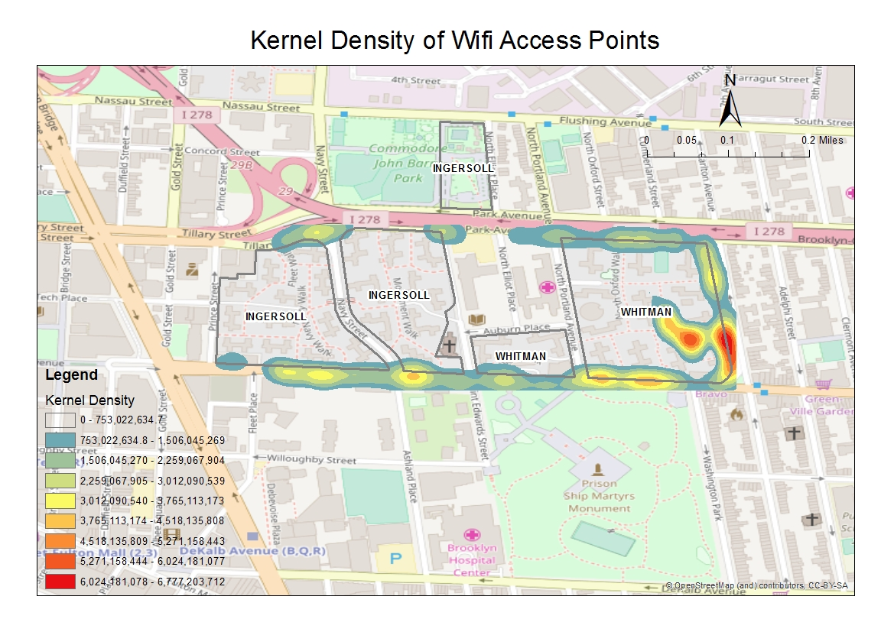

This folder is about how to pull data from database, and shows the visualization of cleaned data collected through mobile.

**Log in**

```bash
ssh netid@gw.cusp.nyu.edu
ssh compute
ssh wifind@wifind.cusp.nyu.edu
mysql -uroot -p
```

```mysql
show databases;
+--------------------+
| Database           |
+--------------------+
| information_schema |
| capstonemysql      |
| mysql              |
| performance_schema |
| sys                |
+--------------------+
5 rows in set (0.00 sec)
```

```mysql
use capstonemysql;
show tables;
```

```mysql
describe wifi_scan;
```

```mysql
exit;
# Pull the data from the database.

mysql -uroot -p capstonemysql -e "select * from wifi_scan limit 30000" -B | sed "s/'/\'/;s/\t/\",\"/g;s/^/\"/;s/$/\"/;s/\n//g" > dxm10000.csv

scp wifind@wifind.cusp.nyu.edu:t10000.csv ./
```

```wifind
mv dxm10000.csv Wifind_file/
cd Wifind_file
ls
sudo git add dxm10000.csv; sudo git commit -m "dxm10000.csv"; sudo git push
```

After cleanning the data, I use the tool of the Kernel Density with ArcGIS to plot the density of all the access poins.




Besides, I make the choropleth map of signal stregths of free wifi, which is "downtownbrooklynwifi_fon".

